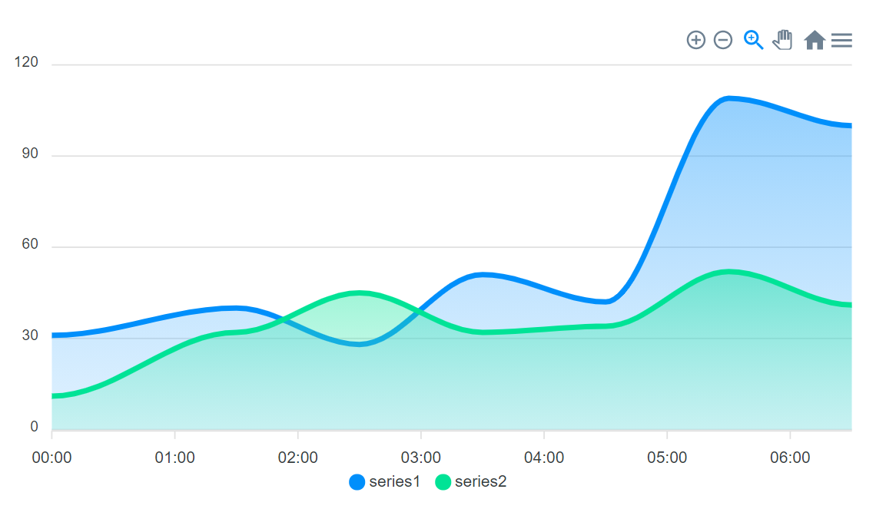

# Starter Kit: Create Angular application using Web Components

This project was generated with [Angular CLI](https://github.com/angular/angular-cli) version 11.2.10. The repository contains sample code that you can use as a starting point to develop Angular applications with Web Components. The chart visualization has been created by using [ApexCharts](https://apexcharts.com/) which has good support for [Angular specific charts](https://apexcharts.com/angular-chart-demos/)



## About Web Components

Web components are a set of browser APIs that enable developers to create custom and reusable HTML tags that can be used in web apps just like standard HTML tags. Since Web components are built on top of standards, they can work across all modern web browsers.

Web components are based on four technologies:

* Custom Elements: A set of various builtin JavaScript APIs designed to define custom elements. Custom Elements are another name for web components.
* Shadow DOM: A set of builtin JavaScript APIs for creating and attaching a private DOM tree to an element. This will allow you to create custom elements which are isolated from the rest of the HTML document.
* ES Modules.
* HTML Templates: This provides developers with elements like `<template>` and `<slot>` to create reusable templates.

You can create a custom web component using JavaScript and a set of builtin methods such as `customElements.define()`.

You can then use the custom element just like you would normally use any HTML tag. For example if AppMenu is the name of our custom element, we can use it as follows in our HTML document:

```
<AppMenu></AppMenu>
```

Here you can read more about how an Angular application can be transformed into a Web Component: [Building Web Components with Angular](https://buddy.works/tutorials/building-web-components-with-angular)

## Requirements

The following item is required to run this example:

* [Node.js](https://nodejs.org/)
* [Angular CLI](https://github.com/angular/angular-cli)

## How to get started

### 1. Clone the repository and install dependencies

Clone the repository, go inside the folder and run the following command on your terminal to install all dependencies:
```bash
$ npm install
```

### 2. Run the application

When the node modules have finished installing it's time to start the application:
```
npm start
```

The above command will start the development server. Go to [localhost:4200](http://localhost:4200/) to visit the application.

## Behind the scenes: Transforming the Angular Component to A Web Component

A few changes are needed to transform an Angular component to a Web Component. Open the `src/app/app.module.ts` file to see how the component has been converted:

    import { BrowserModule } from "@angular/platform-browser";
    import { Injector, NgModule } from "@angular/core";

    import { AppComponent } from "./app.component";
    import { NgApexchartsModule } from "ng-apexcharts";

    // Add createCustomElement to the imports
    import { createCustomElement } from "@angular/elements";

    @NgModule({
    declarations: [AppComponent],
    imports: [BrowserModule, NgApexchartsModule],
    providers: [],
    bootstrap: [AppComponent]
    })

    // Inject `Injector` via the module constructor
    // Call the `createCustomElement()` method to transform the component to a custom element
    export class AppModule {
    constructor(injector: Injector) {
        const el = createCustomElement(AppComponent, { injector });
        customElements.define('app-chart', el);
    }

    ngDoBootstrap() {}
    }

The component can now be used as a Web Component in the following way by adding `<app-chart></app-chart>` to your `index.html file`:

    <!doctype html>
    <html lang="en">

    <head>
        <meta charset="utf-8">
        <title>Angular</title>
        <base href="/">

        <meta name="viewport" content="width=device-width, initial-scale=1">
        <link rel="icon" type="image/x-icon" href="favicon.ico">
    </head>

    <body>
        <app-chart></app-chart>
    </body>

    </html>